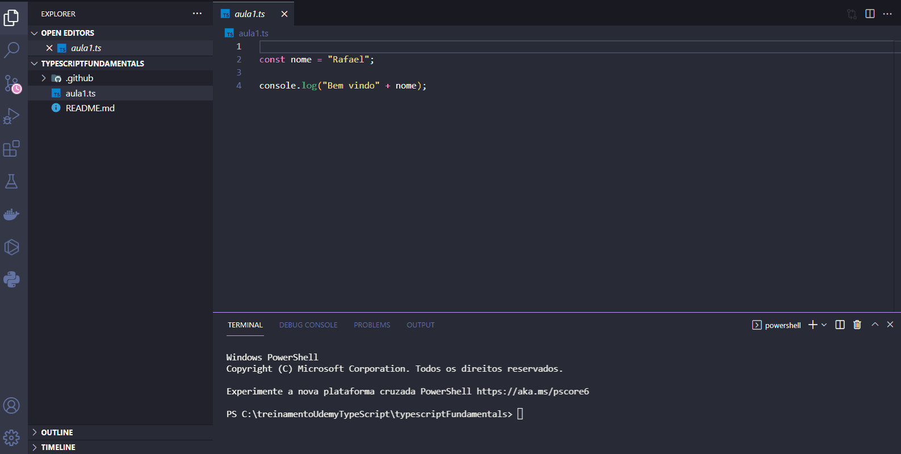

<h1 align="center">
  
</h1>

<h3 align="justify">
Didactic demonstration of a simple application in typescript. Local installation, construction and possible errors. Udemy TypeScript Course Credits Learn from scratch to advanced in practice, Professor Matheus Fraga.
</h3>

 

## 📷 Demonstration

  

 

## 🚀 Technologies

This project was developed with the following technologies:

- [TypeScript](https://www.typescriptlang.org/)

 

## ⚙ Commands
- npm install -g typescript
- tsc "name file" (build)
- node "name file" (running node)

 

Made with 💜 by Rafael Maciel